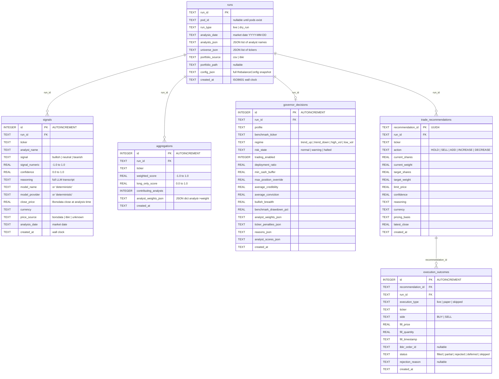

# feat: Decision DB -- Append-Only Decision Ledger

## Overview

Create an append-only SQLite decision ledger (`data/decisions.db`) that captures the full pipeline chain: analyst signals -> aggregation -> governor decisions -> trade recommendations -> execution outcomes. This is the foundational data layer for the trading pod shop architecture -- every downstream feature (pods, paper trading, scorecards, dashboards) depends on having a queryable history of what the system decided and what happened next.

## Problem Statement

Analyst signals are currently transient. `analysis_cache.py` uses UPSERT (overwrites on re-run at line 178), `analysis_storage.py` writes to the web app's `hedge_fund.db` with no link to execution outcomes, and `governor_history.db` stores snapshots disconnected from the signals that produced them. You cannot answer: "What did the system recommend on March 5, at what price, and what happened next?" (see origin: `docs/brainstorms/2026-03-24-decision-db-requirements.md`)

## Proposed Solution

A new `src/data/decision_store.py` module using raw `sqlite3` (consistent with all CLI-side data modules) that writes to `data/decisions.db`. Six tables capture each pipeline stage. Writes are eager (per-signal as analysts produce output) for crash resilience. WAL mode enabled for concurrent access. Existing databases continue unchanged -- this is purely additive.

## Technical Approach

### Architecture

The Decision DB follows the established raw `sqlite3` singleton pattern used by `analysis_cache.py`, `analyst_task_queue.py`, and `GovernorStore`. It is NOT a SQLAlchemy module (that pattern is only used for the web app's `hedge_fund.db`).

**Pattern reference:** `src/data/analysis_cache.py` (singleton accessor, per-operation connections, `CREATE TABLE IF NOT EXISTS` schema, TEXT columns for JSON blobs)

**New pattern:** WAL mode (`PRAGMA journal_mode=WAL`) -- first use in the project, required for concurrent eager writes from `ThreadPoolExecutor` threads.

### ERD



### Implementation Phases

#### Phase 1: Core Module + Schema

Create `src/data/decision_store.py` with the `DecisionStore` class.

**Tasks:**
- [ ] Create `src/data/decision_store.py` with raw `sqlite3` pattern
- [ ] Implement `_initialize()` with `CREATE TABLE IF NOT EXISTS` for all 6 tables
- [ ] Enable WAL mode: `PRAGMA journal_mode=WAL` in `_initialize()`
- [ ] Use per-operation connections (`with sqlite3.connect(self.db_path) as conn:`) for thread safety
- [ ] Implement `get_decision_store()` singleton accessor (following `analysis_cache.py` lines 204-212)
- [ ] DB path: `data/decisions.db` (already gitignored by `*.db` pattern in `.gitignore` line 59)
- [ ] Add indexes: `(run_id)` on all tables, `(ticker, analysis_date)` on signals, `(analyst_name, ticker, analysis_date)` on signals, `(recommendation_id)` on execution_outcomes

**Write methods (all INSERT-only, never UPSERT):**
- [ ] `record_run(run_id, pod_id, run_type, analysis_date, analysts, universe, config)` -> inserts into `runs`
- [ ] `record_signal(run_id, ticker, analyst_name, signal, signal_numeric, confidence, reasoning, model_name, model_provider, close_price, currency, price_source, analysis_date)` -> inserts into `signals`
- [ ] `record_aggregations(run_id, aggregations: list[dict])` -> batch insert into `aggregations`
- [ ] `record_governor_decision(run_id, governor_decision: GovernorDecision)` -> inserts into `governor_decisions`
- [ ] `record_trade_recommendations(run_id, recommendations: list[dict])` -> batch insert into `trade_recommendations`, generates `recommendation_id` (UUID4) for each
- [ ] `record_execution_outcomes(run_id, outcomes: list[dict])` -> batch insert into `execution_outcomes`

**Read methods:**
- [ ] `get_run(run_id)` -> full run metadata
- [ ] `get_signals(run_id=None, ticker=None, analyst=None, date_from=None, date_to=None)` -> filtered signal query
- [ ] `get_decision_chain(run_id)` -> full chain: run + signals + aggregations + governor + trades + executions
- [ ] `get_runs(date_from=None, date_to=None, pod_id=None)` -> filtered run listing

**File structure:**
```
src/data/decision_store.py    # New module (~300-400 lines)
```

#### Phase 2: Pipeline Integration -- Signals (Eager Writes)

Inject signal writes into the analyst execution path in `enhanced_portfolio_manager.py`.

**Integration point:** Inside `run_analyst()` inner function at ~line 549-568, right where `analysis_cache.store_analysis()` and `save_analyst_analysis()` are already called. Add `decision_store.record_signal()` as a third write.

**Tasks:**
- [ ] In `enhanced_portfolio_manager.py`, import `get_decision_store` from `src/data/decision_store`
- [ ] After `analysis_cache.store_analysis()` call (~line 549), add `decision_store.record_signal()` with all available fields
- [ ] Capture `close_price` from the prefetched data (already available in the `run_analyst()` scope via `state["prefetched_financial_data"]` or the Borsdata price data)
- [ ] Handle the cache-hit path too (~line 427): when signals are loaded from cache, also write them to Decision DB (they're new signals for this run even if the LLM result was cached)
- [ ] Wrap Decision DB writes in try/except to avoid breaking the pipeline if the DB write fails (log warning, continue)

**Thread safety:** Each `record_signal()` call opens its own `sqlite3.connect()`, writes one INSERT, and closes. WAL mode allows concurrent writers. Under 50 threads x microsecond writes, contention is negligible vs the seconds-per-analyst LLM latency.

**Price context:** The prefetched financial data is available in the agent state. Extract the latest close price for the ticker being analyzed. If unavailable, store NULL.

#### Phase 3: Pipeline Integration -- Run + Aggregation + Governor

Inject run, aggregation, and governor writes. These are all single-threaded (happen after parallel signal collection).

**Tasks:**
- [ ] In `portfolio_runner.py`, after `session_id = str(uuid.uuid4())` (line 371), call `decision_store.record_run()` with the session_id and config snapshot
- [ ] In `enhanced_portfolio_manager.py`, after `_aggregate_signals()` with governor weights (~line 181), call `decision_store.record_aggregations()` with the aggregated scores per ticker
- [ ] After `_evaluate_governor()` (~line 175-178), call `decision_store.record_governor_decision()` with the `GovernorDecision` dataclass -- this is additive to the existing `GovernorStore.save_snapshot()` which continues writing to `governor_history.db`

#### Phase 4: Pipeline Integration -- Trades + Execution

Inject trade recommendation and execution outcome writes. This requires threading `session_id` to the IBKR execution layer.

**Tasks:**
- [ ] After `_generate_recommendations()` (~line 201), call `decision_store.record_trade_recommendations()`. This generates a `recommendation_id` (UUID4) for each recommendation and adds it to the recommendation dict.
- [ ] Thread `session_id` through `RebalanceOutcome` to the CLI execution call sites. `RebalanceOutcome` (line 415 of `portfolio_runner.py`) already contains `session_id`. The CLI layers (`cli/hedge.py` line 150, `portfolio_manager.py` line 142) pass `outcome.results["recommendations"]` to `execute_ibkr_rebalance_trades()` -- also pass `outcome.session_id`.
- [ ] After `execute_ibkr_rebalance_trades()` returns `ExecutionReport`, call `decision_store.record_execution_outcomes()` matching each `OrderStatusResult` to its `recommendation_id` by ticker.
- [ ] For skipped orders (`OrderSkip` in `ExecutionReport.skipped`), record execution outcome with `status='skipped'` and `rejection_reason`.
- [ ] For deferred orders (market closed), record with `status='deferred'`.

**Linking strategy:** `recommendation_id` is generated when trade recommendations are recorded (Phase 4 step 1). It is attached to each recommendation dict so that when execution outcomes are recorded, they can reference back. The link is by `recommendation_id`, not by ticker (handles the case of multiple order attempts for the same ticker).

#### Phase 5: Verification

- [ ] Run `poetry run python src/main.py --ticker AAPL --analysts favorites --dry-run` and verify signals, aggregations, governor decisions, and trade recommendations appear in `decisions.db`
- [ ] Inspect DB with `sqlite3 data/decisions.db "SELECT * FROM signals LIMIT 5;"` to verify schema and data
- [ ] Verify `PRAGMA journal_mode;` returns `wal`
- [ ] Run with `--limit 2` to verify a full pipeline writes to all tables
- [ ] Verify existing functionality unchanged: `analysis_cache`, `governor_history.db`, `hedge_fund.db` all still written to
- [ ] Run `poetry run pytest` to confirm no regressions

## System-Wide Impact

### Interaction Graph

When `run_analyst()` completes for a single analyst x ticker:
1. `analysis_cache.store_analysis()` -> UPSERT to `prefetch_cache.db` (existing, unchanged)
2. `save_analyst_analysis()` -> INSERT to `hedge_fund.db` (existing, unchanged)
3. **NEW:** `decision_store.record_signal()` -> INSERT to `decisions.db`

When `_evaluate_governor()` completes:
1. `GovernorStore.save_snapshot()` -> INSERT to `governor_history.db` (existing, unchanged)
2. **NEW:** `decision_store.record_governor_decision()` -> INSERT to `decisions.db`

When IBKR execution completes:
1. IBKR order submission/status polling (existing, unchanged)
2. **NEW:** `decision_store.record_execution_outcomes()` -> INSERT to `decisions.db`

### Error Propagation

All Decision DB writes are wrapped in try/except. A failure to write to `decisions.db` logs a warning but does NOT abort the pipeline. The Decision DB is a passive observer -- it cannot cause a rebalance to fail. This is critical because the Decision DB is new and untested; it must not break existing production functionality.

### State Lifecycle Risks

- **Partial runs:** Eager writes mean a crashed run leaves orphaned signal rows with no aggregation/governor/trade records. This is intentional and desirable (crash resilience). Queries should handle runs with only partial data.
- **Dual-write divergence:** The Decision DB and existing stores (analysis_cache, governor_history, hedge_fund.db) will contain overlapping data. They may drift if one write succeeds and the other fails. This is acceptable during the transition period -- the Decision DB is the future source of truth, existing stores are maintained for backward compatibility.

### API Surface Parity

No external APIs are affected. The Decision DB is a new internal write path only.

## Acceptance Criteria

### Functional Requirements

- [ ] Every analyst signal from a rebalance run appears in `signals` table with full transcript, price context, and model info
- [ ] Aggregated scores appear in `aggregations` table linked by `run_id`
- [ ] Governor decision appears in `governor_decisions` table linked by `run_id`
- [ ] Trade recommendations appear in `trade_recommendations` table with `recommendation_id`
- [ ] Execution outcomes (when IBKR is used) appear in `execution_outcomes` table linked to recommendations
- [ ] `get_decision_chain(run_id)` returns the full pipeline for any completed run
- [ ] Re-running the same analysis date creates NEW rows (not UPSERTs)
- [ ] A mid-run crash preserves all signals written before the crash
- [ ] Existing `analysis_cache`, `governor_history.db`, `hedge_fund.db` writes continue unchanged
- [ ] DB uses WAL mode for concurrent access

### Non-Functional Requirements

- [ ] Decision DB writes do not increase pipeline runtime by more than 1% (SQLite microseconds vs LLM seconds)
- [ ] Decision DB failures do not abort the pipeline (try/except around all writes)
- [ ] `decisions.db` is gitignored (covered by existing `*.db` pattern)

## Dependencies & Prerequisites

- Requires understanding of `EnhancedPortfolioManager` internals (researched: integration points identified at specific line numbers)
- `session_id` must be threaded to IBKR execution (currently stops at `RebalanceOutcome`)
- Borsdata close prices must be extractable at signal time (available via prefetched data in agent state)
- No external dependencies -- uses stdlib `sqlite3`

## Risk Analysis & Mitigation

| Risk | Likelihood | Impact | Mitigation |
|------|-----------|--------|------------|
| WAL mode lock contention under 50 threads | Low | Medium | Per-operation connections + WAL mode handles this. LLM latency (seconds) means writes are naturally staggered. |
| Breaking existing pipeline | Low | High | All Decision DB writes wrapped in try/except. Existing stores unchanged. |
| Schema needs evolution later | High | Low | `CREATE TABLE IF NOT EXISTS` + `ALTER TABLE` for additions. No Alembic needed for raw sqlite3. |
| DB grows large over time | Medium | Low | At ~400 rows/run x weekly = ~20K rows/year. SQLite handles millions of rows. Archival is a future concern. |
| Dual-write divergence | Medium | Low | Acceptable during transition. Decision DB becomes source of truth later. |

## Key Decisions Carried Forward from Origin

- **Full pipeline capture** -- not just signals, the entire decision chain (see origin: R1-R8)
- **SQLite, standalone file** -- new `decisions.db`, not extending existing DBs (see origin: R11)
- **Eager writes** -- signals as they arrive for crash resilience (see origin: R9)
- **Store everything** -- full transcripts, price context, all governor reasoning (see origin: R3, R4)
- **No migration** -- starts fresh, old DBs continue unchanged (see origin: R12)
- **pod_id nullable** -- column exists but NULL until Pod Abstraction is built (see origin: R2 scope boundary)

## Resolved Questions from Origin

| Question | Resolution |
|----------|-----------|
| TEXT or JSON for reasoning? | TEXT -- consistent with existing patterns. JSON blobs stored as `json.dumps()` into TEXT columns (governor store pattern). SQLite JSON1 not used anywhere in codebase. |
| Where to inject eager writes? | `run_analyst()` inner function at ~line 549-568 of `enhanced_portfolio_manager.py` -- already writes to analysis_cache and analysis_storage here. |
| IBKR bid/ask at signal time? | Not available -- IBKR snapshots only fetched during execution. Capture Borsdata close at signal time; IBKR fill prices only at execution time. |
| WAL mode? | Yes -- required for concurrent eager writes from ThreadPoolExecutor. First use in project. |
| Aggregation intermediate data? | `_aggregate_signals()` returns `Dict[str, float]` (ticker -> weighted score). Store per-ticker with contributing analyst count and weights. |
| Linking records across tables? | Shared `run_id` (existing `session_id` UUID4) + `recommendation_id` (new UUID4) for trade -> execution FK. |
| Backtest runs? | Excluded for now. Add `run_type` column on `runs` table for future backtest support. |
| Timestamp semantics? | Both: `analysis_date` (market date, YYYY-MM-DD) and `created_at` (wall-clock ISO8601). Query patterns (R13) use `analysis_date`. |

## Sources & References

### Origin

- **Origin document:** [docs/brainstorms/2026-03-24-decision-db-requirements.md](docs/brainstorms/2026-03-24-decision-db-requirements.md) -- Key decisions: full pipeline capture, SQLite standalone, eager writes, store everything, no migration, pod_id nullable.

### Internal References

- Pipeline orchestration: `src/services/portfolio_runner.py:332` (`run_rebalance`), `:371` (`session_id` generation)
- Signal collection: `src/agents/enhanced_portfolio_manager.py:549-568` (`run_analyst()` write paths)
- Cache-hit write path: `src/agents/enhanced_portfolio_manager.py:427-428`
- Aggregation: `src/agents/enhanced_portfolio_manager.py:181` (post-`_aggregate_signals`)
- Governor evaluation: `src/agents/enhanced_portfolio_manager.py:175-178` (post-`_evaluate_governor`)
- Trade generation: `src/agents/enhanced_portfolio_manager.py:201-203` (post-`_generate_recommendations`)
- IBKR execution: `src/cli/hedge.py:150`, `src/integrations/ibkr_execution.py:136`
- Existing singleton pattern: `src/data/analysis_cache.py:204-212`
- Existing append-only pattern: `src/services/portfolio_governor.py:101-199` (`GovernorStore`)
- Existing per-operation connection pattern: `src/data/analysis_cache.py`, `src/data/analyst_task_queue.py`
