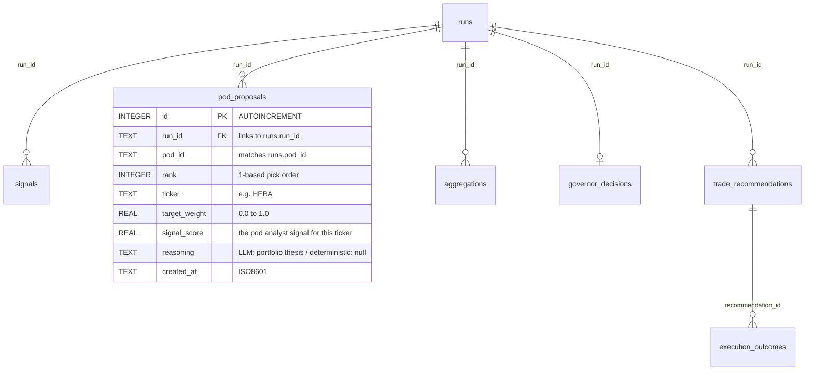

# feat: Pod Abstraction -- Config-Driven Analyst Pods with Independent Paper P&L

## Overview

Transform the flat analyst list into config-driven pods where each pod (= 1 analyst) proposes its own complete portfolio, tracks paper P&L independently, and merges into a single portfolio for real execution. This is a two-part effort: first decompose the 67KB EnhancedPortfolioManager into clean pipeline stages, then layer the pod abstraction on top.

## Problem Statement

Analysts are a flat list selected by hardcoded presets. They emit per-ticker signals that merge into one aggregated score -- there's no concept of an analyst proposing a complete portfolio, no independent P&L tracking, and no way to evaluate which strategies perform well over time. The trading pod shop vision requires each analyst to operate as an independent pod: proposing its own portfolio, tracking its own paper returns, and being evaluable as a standalone strategy. (see origin: `docs/brainstorms/2026-03-24-pod-abstraction-requirements.md`)

## Proposed Solution

**Part A -- EPM Decomposition:** Extract `EnhancedPortfolioManager.generate_rebalancing_recommendations()` (1,658 lines) into composable pipeline stages: `SignalCollector`, `SignalAggregator`, `PositionSizer`, `TradeGenerator`. The original class becomes a thin orchestrator.

**Part B -- Pod Abstraction:** Introduce a `Pod` dataclass loaded from `pods.yaml`. Each pod wraps one analyst, runs the pipeline through the decomposed stages, and produces a portfolio proposal (top N picks with weights). Proposals are logged in Decision DB, paper P&L is tracked, and active pods merge into one portfolio for governor evaluation and IBKR execution.

## Technical Approach

### Architecture

The current monolithic pipeline:
```
CLI → Runner → EPM.generate_rebalancing_recommendations() → Governor → IBKR
                   (1,658 lines doing everything)
```

Becomes:
```
CLI → Runner → Pod Config Resolution
                 ↓
               For each pod (sequential):
                 SignalCollector.collect(pod.analyst, universe)
                 → PodProposer.propose(signals, max_picks=3)
                 → Decision DB (pod_id, signals, proposal)
                 ↓
               PodMerger.merge(all_proposals, equal_weight)
                 ↓
               Governor.evaluate(merged_portfolio)
                 ↓
               PositionSizer.size(merged, portfolio, constraints)
                 ↓
               TradeGenerator.generate(current_vs_target)
                 ↓
               IBKR Execution
```

### ERD -- New Decision DB Table



One row per pick per proposal. A pod proposing 3 picks = 3 rows sharing the same `run_id` + `pod_id`. The `reasoning` column holds the LLM portfolio synthesis (one reasoning per proposal, repeated on rank=1 row, NULL on others) or NULL for deterministic pods.

No `pod_id` column is added to the 5 existing tables. `pod_id` lives on `runs` and cascades via `run_id` JOIN. (SpecFlow analysis confirmed this is sufficient; denormalization deferred.)

### pods.yaml Schema

Location: `config/pods.yaml` (new `config/` directory).

```yaml
# config/pods.yaml -- Pod definitions
# Each pod wraps one analyst and proposes its own portfolio.

defaults:
  max_picks: 3
  enabled: true

pods:
  - name: warren_buffett
    analyst: warren_buffett
  - name: charlie_munger
    analyst: charlie_munger
  - name: jim_simons
    analyst: jim_simons
  - name: fundamentals
    analyst: fundamentals_analyst
  - name: technical
    analyst: technical_analyst
    max_picks: 5          # override default
  - name: valuation
    analyst: valuation_analyst
  - name: sentiment
    analyst: sentiment_analyst
  - name: news_sentiment
    analyst: news_sentiment_analyst
    enabled: false        # disabled by default
  # ... remaining 9 famous investors
```

Fields per pod:
- `name` (required): unique pod identifier, used as `pod_id` in Decision DB
- `analyst` (required): key from `ANALYST_CONFIG` in `src/utils/analysts.py`
- `enabled` (optional, default from `defaults`): whether pod runs
- `max_picks` (optional, default from `defaults`): portfolio size

**Deferred pod fields** (not implemented now, reserved for future): `universe_filter`, `governor_profile`, `schedule`, `capital_allocation`.

### Portfolio Proposal Mechanism

**Two-stage approach** for all analysts (see origin: R5, R6, R7):

**Stage 1 -- Per-ticker analysis (unchanged):** Each analyst analyzes each ticker individually, producing `{signal, confidence, reasoning}`. These are saved to Decision DB `signals` table.

**Stage 2 -- Portfolio synthesis (new):**

*LLM-based analysts (13 famous + news_sentiment):*
A second, lightweight LLM call receives all of the analyst's per-ticker signals for this run as context and asks: "Based on your analyses, propose your top N portfolio picks with allocation weights. Long-only." The prompt includes the analyst's persona/philosophy, the ticker signals with reasoning, and a structured output format. Cost: ~1 additional LLM call per pod per run (vs N ticker-analysis calls already made).

*Deterministic analysts (fundamentals, technical, sentiment, valuation):*
Sort tickers by absolute signal score descending, take top N. Assign weights proportional to score (normalized to sum to 1.0). No LLM call needed. No reasoning field.

### Merge Algorithm

Equal-weight pod-level split, then sum overlapping tickers (see origin: R14, R16).

**Concrete example:**
- 3 active pods, each gets 1/3 of total portfolio weight
- Buffett proposes: HEBA 40%, NIBE 35%, LUND 25%
- Simons proposes: HEBA 30%, ERIC 40%, VOLV 30%
- Fundamentals proposes: NIBE 50%, HEBA 25%, SEB 25%

Merge (each pod scaled to 1/3):
- HEBA: (40% × 1/3) + (30% × 1/3) + (25% × 1/3) = 31.7%
- NIBE: (35% × 1/3) + (50% × 1/3) = 28.3%
- ERIC: (40% × 1/3) = 13.3%
- VOLV: (30% × 1/3) = 10.0%
- LUND: (25% × 1/3) = 8.3%
- SEB: (25% × 1/3) = 8.3%

Total: 100%. 6 unique tickers. If `max_holdings=8`, all fit. If `max_holdings=5`, drop lowest-weight tickers (SEB, LUND) and re-normalize.

High-consensus tickers (HEBA appears in all 3 pods) naturally get amplified. Low-conviction single-pod picks get small allocations. This is the desired behavior.

**Implementation:** `PodMerger.merge(proposals: list[PodProposal], max_holdings: int) -> dict[str, float]`

### Paper P&L Computation

A proposal is **active from its `created_at` until superseded** by the next proposal from the same pod (see origin: R11, R12).

Computed on-demand, not stored incrementally:
1. Query `pod_proposals` for pod X, ordered by `created_at`
2. For each proposal period (created_at to next_proposal_created_at or now):
   - Fetch Borsdata close prices for the tickers at start and end of period
   - Compute weighted return: `sum(weight_i * (price_end_i / price_start_i - 1))`
3. Chain period returns for cumulative P&L

This is a read-path-only computation. No daily mark-to-market job needed. Suitable for the `hedge pods` CLI command.

### Pod Execution Order

**Sequential, one pod at a time** (see origin: Dependencies -- rate limits).

With 17 pods × 30 tickers, parallel execution would fire 510+ concurrent LLM calls. The existing `max_workers` handles intra-pod parallelism (1 analyst × N tickers in parallel). Pods themselves run serially. The runner loops over pods, completing each before starting the next.

### Governor Placement

**Post-merge only** (see origin: R15). The governor sees one merged portfolio and applies risk controls (deployment_ratio, ticker_penalties, buy blocking). Per-pod governor evaluation is deferred to the future Governor Pod Lifecycle feature (#6 in the ideation sequence).

Per-pod `governor_profile` overrides are not implemented in this phase. The merged portfolio uses the CLI-level `--governor-profile` flag.

### CLI Migration

Both `--analysts` and `--pods` flags coexist during transition:
- `--pods all` / `--pods "buffett,simons"` / `--pod buffett`: New pod-based selection
- `--analysts fundamentals`: Legacy flag, creates an ephemeral single-pod on the fly. Prints deprecation warning.
- If neither is specified: default to `--pods all` (all enabled pods from config)

### Implementation Phases

#### Phase 1: EPM Decomposition (prerequisite, separate PR)

Extract `EnhancedPortfolioManager.generate_rebalancing_recommendations()` into composable modules. The original class becomes a thin orchestrator delegating to these stages.

**New modules:**

```
src/services/pipeline/
    __init__.py
    signal_collector.py     # Step 1: parallel analyst execution
    signal_aggregator.py    # Step 2: weighted signal merge
    position_sizer.py       # Steps 4-6: long-only, selection, target weights
    trade_generator.py      # Step 7: diff current vs target, recommendations
```

**Tasks:**

- [ ] Create `src/services/pipeline/` package
- [ ] Extract `signal_collector.py` from EPM steps 1: `_collect_analyst_signals()` (lines 238-700), `_run_single_analyst()`, `run_analyst()` inner function, cache-hit batch path. Preserves ThreadPoolExecutor parallelism, 120s timeout (Session 55 fix), and Decision DB eager writes. Input: analyst list, universe, model_config, prefetched data. Output: `list[AnalystSignal]`.
- [ ] Extract `signal_aggregator.py` from EPM step 2: `_aggregate_signals()` (lines 790-824). Input: signals, analyst_weights. Output: `dict[str, float]` (ticker -> score). **Critical:** preserve ticker-level merge, not dict.update() -- Session 34 parallel merge bug.
- [ ] Extract `position_sizer.py` from EPM steps 4-6: `_apply_long_only_constraint()` (lines 848-859), `_select_top_positions()` (lines 861-875), `_calculate_target_positions()` (lines 877-932). Input: scores, max_holdings, max_position, min_position, governor overrides. Output: `dict[str, float]` (ticker -> target weight).
- [ ] Extract `trade_generator.py` from EPM step 7: `_generate_recommendations()` (lines 1186-1311), `_calculate_updated_portfolio()`. Input: current portfolio, target weights, prices. Output: `list[Recommendation]`.
- [ ] Refactor `EnhancedPortfolioManager.generate_rebalancing_recommendations()` to call the extracted modules. Same input/output contract -- no caller changes needed.
- [ ] Run `poetry run pytest` -- all 209+ tests must pass with zero behavior change
- [ ] Run `poetry run hedge rebalance --analysts favorites --dry-run --limit 3` -- verify identical output to pre-refactor

**Key constraint:** This is a pure refactoring. No behavior change. The EPM becomes a thin orchestrator that delegates to the four stage modules.

#### Phase 2: Pod Config System

Introduce the Pod dataclass and YAML config loading.

**New files:**

```
src/config/__init__.py
src/config/pod_config.py    # Pod dataclass + YAML loader
config/pods.yaml            # Default pod definitions
```

**Tasks:**

- [ ] Add `pyyaml` to `pyproject.toml` via `poetry add pyyaml`
- [ ] Create `src/config/pod_config.py` with:
  - `@dataclass Pod(name: str, analyst: str, enabled: bool, max_picks: int)`
  - `load_pods(config_path: Path) -> list[Pod]` -- parses YAML, validates analyst keys against `ANALYST_CONFIG`, raises on syntax errors or unknown analysts
  - `resolve_pods(selection: str, config_path: Path) -> list[Pod]` -- handles "all", comma-separated names, single name
- [ ] Create `config/pods.yaml` with all 17 analysts as pods (13 famous + 4 deterministic), all enabled
- [ ] Validate: `poetry run python -c "from src.config.pod_config import load_pods; print(load_pods('config/pods.yaml'))"`

#### Phase 3: Pod Proposer

New module that synthesizes per-ticker signals into a ranked portfolio proposal.

**New file:**

```
src/services/pipeline/pod_proposer.py
```

**Tasks:**

- [ ] Create `PodProposal` dataclass: `pod_id, run_id, picks: list[PodPick], reasoning: str | None`
- [ ] Create `PodPick` dataclass: `rank, ticker, target_weight, signal_score`
- [ ] Implement `propose_portfolio_llm(pod: Pod, signals: list[AnalystSignal], model_config: dict) -> PodProposal`:
  - Constructs prompt with analyst persona + all ticker signals
  - Calls LLM with structured output (JSON: `{picks: [{ticker, weight, rank}], reasoning}`)
  - Validates: weights sum to ~1.0, all tickers are in the signal set, long-only
  - Fallback: if LLM fails, fall back to deterministic path
- [ ] Implement `propose_portfolio_deterministic(pod: Pod, signals: list[AnalystSignal]) -> PodProposal`:
  - Sort by `abs(signal_score) * confidence` descending
  - Take top `pod.max_picks`
  - Assign weights proportional to score (normalized)
  - No reasoning field
- [ ] Implement `propose_portfolio(pod: Pod, signals: list[AnalystSignal], model_config: dict) -> PodProposal`:
  - Routes to LLM or deterministic based on `ANALYST_CONFIG[pod.analyst].get("uses_llm", True)`
- [ ] Test: `poetry run python -c "..."` with mock signals to verify both paths

#### Phase 4: Decision DB -- Pod Proposals Table

Extend Decision DB with the `pod_proposals` table for storing portfolio proposals.

**Tasks:**

- [ ] Add `pod_proposals` table creation to `DecisionStore._initialize()` in `src/data/decision_store.py`:
  ```sql
  CREATE TABLE IF NOT EXISTS pod_proposals (
      id INTEGER PRIMARY KEY AUTOINCREMENT,
      run_id TEXT NOT NULL,
      pod_id TEXT NOT NULL,
      rank INTEGER NOT NULL,
      ticker TEXT NOT NULL,
      target_weight REAL NOT NULL,
      signal_score REAL,
      reasoning TEXT,
      created_at TEXT NOT NULL
  )
  ```
  Add index: `(pod_id, created_at)` for paper P&L queries.
- [ ] Add `record_pod_proposal(run_id, pod_id, picks: list[dict], reasoning: str | None)` write method
- [ ] Add `get_pod_proposals(pod_id=None, run_id=None, date_from=None, date_to=None)` read method
- [ ] Add `get_pod_paper_pnl(pod_id, date_from=None, date_to=None)` computation method:
  - Fetches proposal sequence for the pod
  - For each active period: fetches Borsdata close prices
  - Returns cumulative return and per-period breakdown
- [ ] Tests: verify insert, query by pod_id, append-only behavior

#### Phase 5: Pod Runner Integration

Wire pods into the rebalance pipeline using the decomposed stages from Phase 1.

**Modified files:**

```
src/services/portfolio_runner.py    # New run_pods() orchestrator
src/cli/hedge.py                    # --pods flag, hedge pods command
```

**New file:**

```
src/services/pipeline/pod_merger.py  # Merges N pod proposals into one portfolio
```

**Tasks:**

- [ ] Create `PodMerger.merge(proposals: list[PodProposal], max_holdings: int) -> dict[str, float]`:
  - Equal weight per pod (1/N)
  - Scale each pod's picks by its weight share
  - Sum overlapping tickers
  - If unique tickers > max_holdings: sort by merged weight, take top max_holdings, re-normalize
  - Return ticker -> target weight dict
- [ ] Create `run_pods(config: RebalanceConfig) -> RebalanceOutcome` in `portfolio_runner.py`:
  1. Load portfolio and universe (existing)
  2. Resolve pods from config via `resolve_pods(config.pods, config_path)`
  3. For each enabled pod (sequential loop):
     a. Generate pod-scoped `run_id` (UUID4)
     b. Record run to Decision DB with `pod_id=pod.name`
     c. Run `SignalCollector.collect()` for the pod's single analyst
     d. Run `PodProposer.propose_portfolio()` from signals
     e. Record proposal to Decision DB `pod_proposals` table
  4. Collect all proposals
  5. Run `PodMerger.merge()` to produce merged portfolio
  6. Run Governor.evaluate() on merged portfolio
  7. Run `PositionSizer.size()` with governor overrides
  8. Run `TradeGenerator.generate()` to produce recommendations
  9. Record merged aggregation, governor decision, trade recommendations to Decision DB (with a separate "merge" run_id)
  10. Return `RebalanceOutcome`
- [ ] Add `--pods` flag to `hedge rebalance` command (default: "all")
- [ ] Add deprecation warning on `--analysts` flag: maps to ephemeral single-pod
- [ ] Add `hedge pods` command: loads pods.yaml, queries Decision DB for latest proposals and paper P&L, displays summary table
- [ ] Add `pods` field to `RebalanceConfig` dataclass

#### Phase 6: Verification

- [ ] Run all pods dry: `poetry run hedge rebalance --pods all --dry-run --limit 3`
  - Verify each pod's signals appear in Decision DB with correct pod_id
  - Verify each pod's proposal appears in `pod_proposals` table
  - Verify merged portfolio produces trade recommendations
- [ ] Run single pod: `poetry run hedge rebalance --pod fundamentals --dry-run`
- [ ] Run legacy path: `poetry run hedge rebalance --analysts favorites --dry-run` -- verify deprecation warning + functional
- [ ] Check pod status: `poetry run hedge pods` -- shows all pods with latest proposals
- [ ] Verify paper P&L: after 2+ runs on different days, `hedge pods` shows returns
- [ ] Inspect Decision DB: `sqlite3 data/decisions.db "SELECT pod_id, COUNT(*) FROM pod_proposals GROUP BY pod_id;"`
- [ ] Run `poetry run pytest` -- all tests pass
- [ ] Verify no regression: compare merged portfolio output to old single-run output with equivalent analyst set

## System-Wide Impact

### Interaction Graph

When `run_pods()` executes:
1. For each pod: `SignalCollector.collect()` → ThreadPoolExecutor → `decision_store.record_signal()` (existing, now with pod_id on run)
2. For each pod: `PodProposer.propose_portfolio()` → `decision_store.record_pod_proposal()` (NEW)
3. `PodMerger.merge()` → pure computation, no side effects
4. `Governor.evaluate()` → `decision_store.record_governor_decision()` (existing)
5. `PositionSizer.size()` → pure computation
6. `TradeGenerator.generate()` → `decision_store.record_trade_recommendations()` (existing)
7. IBKR execution → `decision_store.record_execution_outcomes()` (existing)

### Error Propagation

- Pod proposal failure (LLM timeout, bad response): that pod's proposal is skipped, other pods continue. Warning logged. Merge proceeds with N-1 pods.
- YAML parse failure: hard error, no pods run. User must fix config.
- Unknown analyst key in config: hard error at config load time.
- All Decision DB writes remain try/except (passive observer pattern).
- Paper P&L computation errors (missing prices): return partial results with warnings, not failures.

### State Lifecycle Risks

- **Partial pod run:** If the process crashes mid-way through pod 3 of 17, pods 1-2 have complete proposals in Decision DB. The merge/execution for that run is incomplete. This is fine -- each pod's data is independently useful for paper P&L.
- **Config drift:** If `pods.yaml` changes between runs (pod removed, renamed), historical Decision DB data is still queryable by old pod_id. No cascade deletion.
- **Decision DB pod_proposals table creation:** Uses `CREATE TABLE IF NOT EXISTS` so it's safe to run with existing `decisions.db` that lacks this table.

### API Surface Parity

- CLI: `--pods` flag added, `--analysts` deprecated with warning
- No web API changes (web UI pod dashboard is explicitly out of scope)
- Decision DB: one new table, existing tables unchanged

## Acceptance Criteria

### Functional Requirements (from origin R1-R18)

- [ ] (R1) A pod is a named config unit with one analyst
- [ ] (R2) All pods defined in `config/pods.yaml`
- [ ] (R3) Adding a pod = YAML entry, no code changes
- [ ] (R4) `_resolve_analyst_list()` replaced by pod config resolution
- [ ] (R5) Each pod analyzes all tickers individually (unchanged behavior)
- [ ] (R6) Each pod proposes a complete portfolio (top N picks with weights)
- [ ] (R7) LLM analysts synthesize via LLM call; deterministic analysts rank by score
- [ ] (R8) pod_id populated on Decision DB `runs` table for pod-scoped runs
- [ ] (R9) Pod proposals stored in new `pod_proposals` table
- [ ] (R10) Existing Decision DB tables unchanged and working
- [ ] (R11) Paper P&L computable per pod from proposals + Borsdata prices
- [ ] (R12) P&L computed on-demand from proposal sequence, no separate positions table
- [ ] (R13) Can compare pod paper P&L over rolling windows
- [ ] (R14) Merged portfolio from equal-weight pod combination
- [ ] (R15) Governor evaluates merged portfolio (post-merge only)
- [ ] (R16) Merge step is isolated function replaceable later
- [ ] (R17) CLI accepts `--pod` / `--pods` with deprecation warning on `--analysts`
- [ ] (R18) `hedge pods` command shows pod status and paper P&L

### Non-Functional Requirements

- [ ] EPM decomposition is pure refactoring -- zero behavior change, all tests pass
- [ ] Pod proposal LLM cost: ~1 additional call per pod per run (negligible vs N ticker analyses)
- [ ] Sequential pod execution respects LLM rate limits
- [ ] pods.yaml validation catches errors at load time, not mid-run

### Quality Gates

- [ ] All existing tests pass after EPM decomposition (Phase 1)
- [ ] All existing tests pass after pod integration (Phase 5)
- [ ] End-to-end dry run with `--pods all` produces coherent merged portfolio

## Dependencies & Prerequisites

- **Decision DB shipped** (Session 117, PR #6) -- `pod_id` nullable on `runs` table, eager writes integrated
- **No external dependencies** beyond `pyyaml` (new)
- **EPM decomposition (Phase 1) must merge before Phase 3-5**
- **Borsdata close prices** available via prefetch pipeline for paper P&L

## Risk Analysis & Mitigation

| Risk | Likelihood | Impact | Mitigation |
|------|-----------|--------|------------|
| EPM decomposition introduces regressions | Medium | High | Pure refactoring with identical input/output. Full test suite as gate. Manual diff comparison of output. |
| LLM portfolio proposal produces nonsensical weights | Medium | Medium | Structured output validation. Fallback to deterministic path on failure. |
| LLM proposal cost doubles API spend | Low | Medium | One additional call per pod vs N per-ticker calls. At 3 picks from 30 tickers, the proposal call is ~3% of total cost. |
| Merge of 17 pods × 3 picks = 51 picks exceeds max_holdings | High | Low | Post-merge max_holdings filter drops lowest-weight tickers. This is by design -- consensus picks get amplified, single-pod picks may be dropped. |
| Paper P&L computation slow for long history | Low | Low | On-demand computation queries proposals + prices. SQLite handles this for months of data. Index on (pod_id, created_at). |
| Session 34 merge bug recurrence | Low | High | PodMerger uses explicit per-ticker weight accumulation, never dict.update(). Unit test for overlapping picks. |

## Resolved Questions from Origin

| Question (from origin) | Resolution |
|------------------------|-----------|
| pods.yaml schema and location | `config/pods.yaml`. Schema: name, analyst, enabled, max_picks with defaults section. New `config/` directory. |
| How to modify analyst prompts for proposals | Two-stage: existing per-ticker analysis unchanged, then a second LLM call that receives all signals and proposes a portfolio. Deterministic analysts sort by score and take top N. |
| Decision DB schema for proposals | New `pod_proposals` table (not extending aggregations). One row per pick per proposal. |
| Paper P&L for unchanged proposals | Proposal active until superseded. P&L computed on-demand between proposal timestamps using Borsdata closes. |
| Merge algorithm for overlapping picks | Pod-level equal split (1/N) then sum overlapping tickers. Apply max_holdings post-merge. |
| Migration from --analysts to --pods | Coexist: --pods is primary, --analysts creates ephemeral pod with deprecation warning. |
| Which EPM stages need extraction | All 4 major stages: SignalCollector, SignalAggregator, PositionSizer, TradeGenerator. Full decomposition required for clean pod integration. |
| pod_id on all tables vs run_id join | run_id join is sufficient. pod_id stays only on `runs` table. No schema migration on existing 5 tables. |
| Governor profile per pod | Deferred. Merged portfolio uses CLI-level --governor-profile. Per-pod profiles are a future feature. |
| Pod execution parallelism | Sequential (one pod completes before next starts). Rate limits are the constraint. Intra-pod parallelism via existing ThreadPoolExecutor. |

## Sources & References

### Origin

- **Origin document:** [docs/brainstorms/2026-03-24-pod-abstraction-requirements.md](docs/brainstorms/2026-03-24-pod-abstraction-requirements.md) -- Key decisions: 1 pod = 1 analyst, portfolio proposer not signal emitter, track separate + trade merged, equal-weight merge, single pods.yaml, EPM decomposition prerequisite, long-only, all analysts become pods.

### Internal References

- EPM pipeline stages: `src/agents/enhanced_portfolio_manager.py:160` (`generate_rebalancing_recommendations`)
- Signal collection: `src/agents/enhanced_portfolio_manager.py:238-700` (`_collect_analyst_signals`)
- Signal aggregation: `src/agents/enhanced_portfolio_manager.py:790-824` (`_aggregate_signals`)
- Position sizing: `src/agents/enhanced_portfolio_manager.py:848-932` (long-only + selection + targets)
- Trade generation: `src/agents/enhanced_portfolio_manager.py:1186-1311` (`_generate_recommendations`)
- Analyst registry: `src/utils/analysts.py:24-173` (`ANALYST_CONFIG`)
- Analyst resolution: `src/services/portfolio_runner.py:482-530` (`_resolve_analyst_list`)
- Decision DB: `src/data/decision_store.py:42-162` (schema), `:176-208` (`record_run` with pod_id)
- Governor: `src/services/portfolio_governor.py:228-348` (`evaluate`)
- CLI entry: `src/cli/hedge.py:55` (`rebalance` command)
- Ideation ranking: `docs/ideation/2026-03-24-trading-pod-shop-ideation.md:41-47` (Pod Abstraction #2)

### Institutional Learnings

- **Session 34:** Parallel signal merge bug -- `dict.update()` drops data, must merge at ticker level. Directly relevant to PodMerger implementation.
- **Session 55:** 120s timeout per analyst×ticker task prevents infinite hangs. Must preserve in SignalCollector extraction.
- **Session 117:** Decision DB eager writes pattern. Pod signals use same path, now with pod_id on the run.
