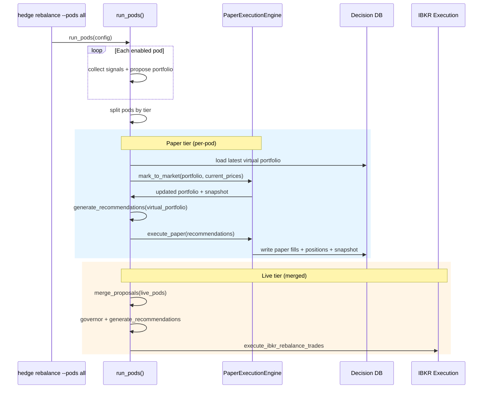
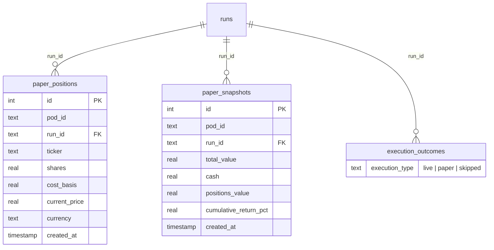

# feat: Paper Trading -- Virtual Execution with Forward P&L Tracking

## Overview

Add a paper trading execution tier so pods can run forward-looking strategies against real market data with virtual fills instead of IBKR orders. Each paper pod maintains its own virtual portfolio (cash + positions), is marked to market on every run, and reports performance metrics (Sharpe, max drawdown, win rate) via `hedge pods status`. This is item #4 from the Trading Pod Shop ideation, building on the shipped Decision DB, Monolith Decomposition, and Pod Abstraction.

## Problem Statement

The system currently jumps from historical backtesting directly to live IBKR execution. There is no intermediate proving ground where a pod can build a forward-looking track record with real data and zero capital risk. This means every new pod or strategy change is tested only against history before risking real money (see origin: `docs/brainstorms/2026-03-24-paper-trading-requirements.md`).

## Proposed Solution

A `PaperExecutionEngine` module that consumes the same recommendation list as IBKR execution, produces virtual fills at the recommendation's `limit_price`, and persists virtual portfolio state in Decision DB. The pipeline forks by tier inside `run_pods()`: paper pods go to PaperExecutionEngine per-pod; live pods continue to merge + IBKR. A `tier` field in `pods.yaml` (with CLI override) controls which path each pod takes.

## Technical Considerations

- **Architecture**: PaperExecutionEngine is a standalone module under `src/services/`. It reuses `generate_recommendations()` with a synthesized `Portfolio` object built from virtual state, preserving sizing fidelity (cash constraints, share rounding, residual allocation).
- **Data model**: Two new append-only tables in Decision DB (`paper_positions`, `paper_snapshots`) plus reuse of existing `execution_outcomes` with `execution_type='paper'`. No schema migration on existing tables.
- **Performance**: Mark-to-market uses cached Borsdata prices (same-date) to avoid extra API calls. Up to 54 tickers (18 pods x 3 positions) is well within the 100-call/10s rate limit if fresh fetch is needed.
- **Currency**: All cash tracked in home currency (SEK). FX conversion at fill time matches `generate_recommendations()` behavior via existing `exchange_rates`.

## System-Wide Impact

- **Interaction graph**: `run_pods()` gains a tier-based fork before the merge step. Paper pods bypass `merge_proposals()` and IBKR execution entirely. Decision DB gains new write paths (paper_positions, paper_snapshots). `hedge pods status` gains DB read paths for paper metrics.
- **Error propagation**: All Decision DB writes follow the passive observer pattern (try/except) -- paper execution failures cannot break the pipeline (see origin doc, Key Decisions). PaperExecutionEngine errors are logged and skipped.
- **State lifecycle risks**: Append-only tables prevent partial-update corruption. "Latest state" queries use `ORDER BY created_at DESC LIMIT 1` per pod_id. If a run crashes mid-write, the next run will read the last complete snapshot.
- **API surface parity**: `hedge pods status` is the only interface. Web UI dashboard is explicitly out of scope (deferred to #7).
- **Integration coverage**: End-to-end test: pod run -> paper fills -> virtual positions -> mark-to-market -> performance metrics displayed.

## Acceptance Criteria

- [ ] Paper pods execute virtual fills without requiring IBKR gateway
- [ ] Each paper pod has independent virtual portfolio (cash + positions)
- [ ] Virtual portfolios persist across runs in Decision DB
- [ ] Mark-to-market updates open position values on every run
- [ ] Paper fills recorded in `execution_outcomes` with `execution_type='paper'`
- [ ] `hedge pods status` shows: positions, cash, portfolio value, cumulative return %, Sharpe ratio, max drawdown, win rate, avg trade P&L
- [ ] Long-only guard: sells skipped for unheld positions, clamped to virtual holdings
- [ ] `tier: paper|live` field works in pods.yaml with CLI `--tier` override
- [ ] Switching a pod from paper to live requires only changing config (paper portfolio frozen)
- [ ] Mixed runs work: paper pods get virtual fills, live pods go to IBKR

## Key Technical Decisions

- **Reuse `generate_recommendations()` for paper pods**: Paper pods synthesize a `Portfolio` object from virtual state and feed it through the same trade generator as live pods. This ensures paper fills reflect real sizing behavior (cash constraints, share rounding). Simpler proposal-to-fill logic was rejected because it would not be an accurate predictor of live behavior.
- **Fork inside `run_pods()`, not in CLI**: A single `run_pods()` call handles both tiers. Pods are split by tier before the merge step. Paper pods go to PaperExecutionEngine; live pods continue to merge + IBKR. This avoids two orchestration paths.
- **Append-only virtual state**: `paper_positions` and `paper_snapshots` tables use INSERT-only semantics (matching Decision DB philosophy). "Current state" is the most recent snapshot per pod. No UPDATEs, no DELETEs.
- **Win rate = realized only**: Win rate counts closed trades only (exit price > entry price). Open positions show unrealized P&L separately. If no trades closed, display "N/A".
- **Tier switch freezes paper portfolio**: When a pod moves from paper to live, its paper snapshots stop. Historical data is preserved. The live pod starts fresh from IBKR state. No inheritance of virtual positions.

## Open Questions

### Resolved During Planning

- **How should paper pods interface with trade generation?** Reuse `generate_recommendations()` with synthesized Portfolio. High fidelity is the point.
- **Where does the tier fork happen?** Inside `run_pods()`, after proposals but before merge. Single entry point.
- **How does multi-currency work?** All cash in home currency (SEK). FX at fill time via existing exchange_rates. Matches live behavior.
- **What is "winning"?** Realized gains on closed trades. Unrealized shown separately. N/A when no closed trades.
- **What happens on tier switch?** Paper portfolio frozen, preserved for historical queries. Live pod starts from real IBKR state.

### Deferred to Implementation

- **Exact starting capital amount**: Default 100,000 in home currency. May adjust after first end-to-end test.
- **Mark-to-market cache freshness threshold**: Use same-date cached prices. If cache is older, fetch fresh. Exact staleness check TBD during implementation.
- **`hedge pods status --refresh` flag**: Deferred. Status shows latest cached snapshot. Explicit M2M refresh can be added later.

## High-Level Technical Design

> *This illustrates the intended approach and is directional guidance for review, not implementation specification. The implementing agent should treat it as context, not code to reproduce.*

### Decision DB Schema Extension

> *Directional guidance. Column types and indexes are illustrative.*

## Implementation Phases

### Phase 1: Foundation (Units 1-2)

Pod tier config and Decision DB schema. Small, safe changes that unblock everything else.

### Phase 2: Core Engine (Units 3-4)

Paper execution engine and mark-to-market. The heart of the feature, built and tested standalone before integration.

### Phase 3: Integration and Dashboard (Units 5-6)

Wire into the pipeline and build the performance dashboard. Makes the feature usable end-to-end.

---

## Implementation Units

- [ ] **Unit 1: Pod Tier Configuration**

**Goal:** Add `tier` and `starting_capital` fields to the Pod system so pods can be classified as paper or live.

**Requirements:** R3, R5

**Dependencies:** None

**Files:**
- Modify: `src/config/pod_config.py`
- Modify: `config/pods.yaml`
- Test: `tests/config/test_pod_config.py`

**Approach:**
- Add `tier: str = "paper"` and `starting_capital: float | None = None` to the `Pod` dataclass (slots=True, so must be in class definition)
- Update YAML loader to read these fields with defaults (backward compatible -- existing pods without `tier` default to `"paper"`)
- Add `defaults.starting_capital` to YAML schema (global default, per-pod override)
- Validate tier values: must be `"paper"` or `"live"`
- `resolve_pods()` unchanged -- it already returns Pod objects, which will now carry tier info

**Patterns to follow:**
- `pod_config.py` existing `defaults` handling pattern for `max_picks` and `enabled`
- Validation pattern: raise ValueError for invalid tier values during YAML load

**Test scenarios:**
- Load pods.yaml with no tier field -> all pods default to `tier="paper"`
- Load pod with explicit `tier: live` -> Pod.tier == "live"
- Load pod with `starting_capital: 200000` -> overrides global default
- Invalid tier value raises error
- `resolve_pods("all")` returns pods with tier attributes

**Verification:**
- All existing tests pass (backward compatible)
- New tests confirm tier and starting_capital loading

---

- [ ] **Unit 2: Decision DB Schema Extension**

**Goal:** Add `paper_positions` and `paper_snapshots` tables to Decision DB for virtual portfolio state persistence.

**Requirements:** R6

**Dependencies:** Unit 1

**Files:**
- Modify: `src/data/decision_store.py`
- Test: `tests/data/test_decision_store.py`

**Approach:**
- Add two new tables in `_initialize()` alongside existing CREATE TABLE statements
- `paper_positions`: id (INTEGER PK AUTOINCREMENT), pod_id (TEXT), run_id (TEXT), ticker (TEXT), shares (REAL), cost_basis (REAL), current_price (REAL), currency (TEXT), created_at (TIMESTAMP DEFAULT CURRENT_TIMESTAMP). Index on (pod_id, created_at).
- `paper_snapshots`: id (INTEGER PK AUTOINCREMENT), pod_id (TEXT), run_id (TEXT), total_value (REAL), cash (REAL), positions_value (REAL), cumulative_return_pct (REAL), starting_capital (REAL), created_at (TIMESTAMP DEFAULT CURRENT_TIMESTAMP). Index on (pod_id, created_at).
- Add write methods: `record_paper_positions(pod_id, run_id, positions)`, `record_paper_snapshot(pod_id, run_id, snapshot)`
- Add read methods: `get_latest_paper_positions(pod_id)` -> list of position dicts, `get_latest_paper_snapshot(pod_id)` -> snapshot dict or None, `get_paper_snapshot_history(pod_id, date_from, date_to)` -> list of snapshots for metrics
- All writes wrapped in try/except (passive observer pattern)
- Per-operation connections, WAL mode (existing pattern)

**Patterns to follow:**
- `record_pod_proposal()` / `get_pod_proposals()` pattern in decision_store.py
- Append-only INSERT pattern (no UPSERT, no UPDATE)

**Test scenarios:**
- Write and read back paper positions for a pod
- Write and read back paper snapshot for a pod
- `get_latest_paper_positions()` returns most recent snapshot only
- `get_paper_snapshot_history()` returns time series ordered by created_at
- Multiple pods have independent state (pod A's positions don't appear in pod B's query)
- Thread safety: concurrent writes from different pods don't conflict (WAL mode)
- Broken-observer mode: DB write failure doesn't raise (passive observer pattern)

**Verification:**
- All existing Decision DB tests pass (no regression on existing 7 tables)
- New tables created automatically on first access
- Read/write round-trip works for both tables

---

- [ ] **Unit 3: Paper Execution Engine**

**Goal:** Build the core PaperExecutionEngine that consumes trade recommendations, validates against virtual holdings, and produces virtual fills.

**Requirements:** R1, R2, R8

**Dependencies:** Unit 2

**Files:**
- Create: `src/services/paper_engine.py`
- Test: `tests/services/test_paper_engine.py`

**Approach:**
- `PaperExecutionEngine` class with methods:
  - `load_virtual_portfolio(pod_id, starting_capital, home_currency)` -> synthesize a `Portfolio` object (from `src/utils/portfolio_loader.py`) from latest paper_positions in Decision DB. If no positions exist (cold start), return empty Portfolio with starting_capital as cash.
  - `execute_paper_trades(pod_id, run_id, recommendations, virtual_portfolio)` -> process recommendations: validate sells against virtual holdings (long-only guard), fill BUY/SELL/INCREASE/DECREASE at `current_price` (the limit_price), update positions and cash, return list of paper fill dicts.
  - `record_paper_results(pod_id, run_id, fills, updated_positions, snapshot)` -> write to Decision DB (execution_outcomes with type='paper', paper_positions, paper_snapshots).
- Long-only guard mirrors `_validate_sells_against_positions()` from ibkr_execution.py: skip sells for unheld tickers, clamp sell quantity to actual virtual holdings.
- Fill price = `recommendation["current_price"]` (this is the limit_price used by IBKR path).
- Cash accounting: BUYs decrement cash by (shares * fill_price), SELLs increment cash.
- Skip HOLD actions (match IBKR behavior).
- Insufficient cash: skip buys that exceed available cash (log warning).

**Patterns to follow:**
- `ibkr_execution.py` `_validate_sells_against_positions()` for long-only guard
- `ibkr_execution.py` `build_order_intents()` for recommendation -> fill translation
- `decision_store.py` passive observer pattern for all DB writes

**Test scenarios:**
- Cold start: empty portfolio, all recommendations are BUYs, fills recorded correctly
- Warm state: existing positions, mix of BUY/SELL/INCREASE/DECREASE
- Long-only guard: SELL for unheld ticker is skipped
- Long-only guard: SELL quantity clamped to actual holdings
- Insufficient cash: BUY skipped when cash < required amount
- HOLD actions are skipped (not recorded as fills)
- Cash accounting: cash decreases on BUY, increases on SELL
- Paper fills written to execution_outcomes with execution_type='paper'
- Virtual positions written to paper_positions
- Snapshot written to paper_snapshots with correct totals

**Verification:**
- Engine processes recommendations end-to-end with correct fills
- All fills have complete provenance (recommendation_id linkage)
- Cash balance is always non-negative after execution

---

- [ ] **Unit 4: Mark-to-Market**

**Goal:** Update open position values with current prices before processing new trades on each run.

**Requirements:** R4

**Dependencies:** Unit 3

**Files:**
- Modify: `src/services/paper_engine.py`
- Test: `tests/services/test_paper_engine.py`

**Approach:**
- Add `mark_to_market(pod_id, run_id, virtual_portfolio, current_prices)` method to PaperExecutionEngine.
- `current_prices`: Dict[str, float] (ticker -> price). Caller provides this from existing Borsdata price fetching (reuse `_get_price_context()` results or parallel fetcher cache).
- For each open position: update `current_price` to market price.
- Compute positions_value = sum(shares * current_price for each position).
- Compute total_value = cash + positions_value.
- Compute cumulative_return_pct = (total_value - starting_capital) / starting_capital * 100.
- Record updated paper_positions and paper_snapshot to Decision DB.
- M2M runs BEFORE new trade processing in the execution flow.

**Patterns to follow:**
- Backtester's `calculate_portfolio_value()` for value computation
- Passive observer for DB writes

**Test scenarios:**
- M2M with price increase: positions_value and total_value increase, positive return
- M2M with price decrease: negative return correctly computed
- M2M with no price change: values unchanged
- M2M on cold start (no positions): only cash, 0% return
- Missing price for a ticker: use last known price (cost_basis fallback), log warning

**Verification:**
- Portfolio snapshot reflects current market prices, not historical fill prices
- Cumulative return % is correct relative to starting capital

---

- [ ] **Unit 5: Pipeline Integration**

**Goal:** Wire PaperExecutionEngine into `run_pods()` and CLI with tier-based routing.

**Requirements:** R1, R2, R5

**Dependencies:** Units 1-4

**Files:**
- Modify: `src/services/portfolio_runner.py`
- Modify: `src/cli/hedge.py`
- Test: `tests/services/test_portfolio_runner.py`

**Approach:**
- In `run_pods()`: after all pods produce proposals, split into `paper_pods` and `live_pods` by `pod.tier`.
- Paper path (per pod):
  1. Load virtual portfolio via `PaperExecutionEngine.load_virtual_portfolio()`
  2. Mark-to-market with current prices (from the same Borsdata fetch used for pricing)
  3. Call `generate_recommendations()` with the virtual portfolio (synthesized Portfolio object)
  4. Call `PaperExecutionEngine.execute_paper_trades()`
  5. Record results to Decision DB
- Live path: merge proposals from live pods only, continue existing governor + IBKR flow.
- If all pods are paper: skip merge + IBKR entirely.
- If all pods are live: no change to existing behavior.
- CLI: add `--tier` option to `hedge rebalance` (type=click.Choice(["paper", "live"])). When set, overrides all pods' tier for that run. Pass through RebalanceConfig.
- Add `tier` field to `RebalanceConfig` dataclass (Optional[str], default None).

**Patterns to follow:**
- Existing `run_pods()` orchestration flow
- `RebalanceConfig` pattern for CLI -> runner config passing
- Dict.update ban: use explicit accumulation for any result merging

**Test scenarios:**
- All paper pods: no IBKR calls, all pods execute through PaperExecutionEngine
- All live pods: existing behavior unchanged (regression test)
- Mixed: paper pods get virtual fills, live pods get merged + IBKR recommendations
- `--tier paper` override: live pods in config are forced to paper for this run
- `--tier live` override: paper pods in config are forced to live for this run
- Empty proposals from a paper pod: M2M still runs for existing positions

**Verification:**
- `hedge rebalance --pods all` with all-paper config runs end-to-end without IBKR gateway
- Mixed tier run produces both paper fills and IBKR recommendations
- Decision DB has paper fills for paper pods, live fills for live pods

---

- [ ] **Unit 6: Performance Dashboard**

**Goal:** Extend `hedge pods status` to show full performance metrics for paper pods.

**Requirements:** R7

**Dependencies:** Units 2-5

**Files:**
- Modify: `src/cli/hedge.py`
- Create: `src/services/paper_metrics.py`
- Test: `tests/services/test_paper_metrics.py`

**Approach:**
- New `paper_metrics.py` module with:
  - `compute_paper_performance(pod_id)` -> dict with all metrics
  - Queries `paper_snapshots` for portfolio value time series -> feeds to `PerformanceMetricsCalculator` for Sharpe, Sortino, max drawdown
  - Queries `execution_outcomes` where `execution_type='paper'` for trade-level metrics -> computes win rate (realized only: closed trades where exit > entry) and avg trade P&L
  - Combines into a single metrics dict
- Extend `hedge pods status` command:
  - For each pod with `tier='paper'`: call `compute_paper_performance()`
  - Display Rich table with columns: Pod, Tier, Positions, Cash, Value, Return %, Sharpe, Max DD, Win Rate, Avg P&L
  - Live pods show tier="live" with their existing proposal info
  - Paper pods with < 2 snapshots show "Insufficient data" for Sharpe/drawdown
  - No closed trades: win rate shows "N/A"
- Win rate definition: (trades where exit price > entry price) / (total closed trades). A trade is "closed" when a SELL fill exists for a position that had a prior BUY fill.

**Patterns to follow:**
- `PerformanceMetricsCalculator` usage in `src/backtesting/metrics.py`
- Existing `hedge pods` Rich table rendering
- `get_pod_proposals()` query pattern for reading from Decision DB

**Test scenarios:**
- Pod with multiple snapshots: Sharpe and max drawdown computed correctly
- Pod with only 1 snapshot: "Insufficient data" displayed
- Pod with closed trades: win rate computed correctly
- Pod with no closed trades: "N/A" for win rate
- Pod with all winning trades: 100% win rate
- Pod with all losing trades: 0% win rate
- Mixed paper and live pods: both show in status table with appropriate columns
- Cumulative return % matches paper_snapshots data

**Verification:**
- `hedge pods status` shows a complete metrics table for paper pods
- Metrics are consistent with Decision DB data (can be verified with manual SQL queries)
- Sharpe/drawdown values match what PerformanceMetricsCalculator would produce independently

---

## Risks & Dependencies

- **Sizing fidelity**: Reusing `generate_recommendations()` with a synthesized Portfolio depends on the function accepting virtual state without IBKR-specific assumptions. If there are hidden dependencies on live portfolio format, the synthesized Portfolio may need adaptation.
- **Price availability**: Mark-to-market assumes Borsdata prices are available for all held positions. If a ticker is delisted or temporarily unavailable, the engine must fall back to last known price.
- **Decision DB write volume**: 18 paper pods running daily = 18 position snapshots + 18 portfolio snapshots + N fills per run. Append-only means unbounded growth. At current scale this is negligible, but a future cleanup/archival mechanism may be needed.
- **Backtester coupling**: `PerformanceMetricsCalculator` is currently in `src/backtesting/`. Importing it from `src/services/` introduces a dependency from services -> backtesting. If this coupling is undesirable, the calculator could be moved to a shared location.

## Sources & References

- **Origin document:** [docs/brainstorms/2026-03-24-paper-trading-requirements.md](docs/brainstorms/2026-03-24-paper-trading-requirements.md) -- Key decisions carried forward: fill price = last known price, per-pod isolation, Decision DB as single store, mark-to-market on run
- **Ideation:** [docs/ideation/2026-03-24-trading-pod-shop-ideation.md](docs/ideation/2026-03-24-trading-pod-shop-ideation.md) -- Item #4 in the implementation sequence
- Related code: `src/integrations/ibkr_execution.py` (execution pipeline to mirror), `src/data/decision_store.py` (DB to extend), `src/services/portfolio_runner.py` (orchestration to modify), `src/config/pod_config.py` (Pod dataclass), `src/backtesting/metrics.py` (PerformanceMetricsCalculator to reuse)
- Institutional learnings: `docs/solutions/architecture/monolith-decomposition-pod-abstraction.md` (passive observer pattern, dict.update ban, timeout discipline)
