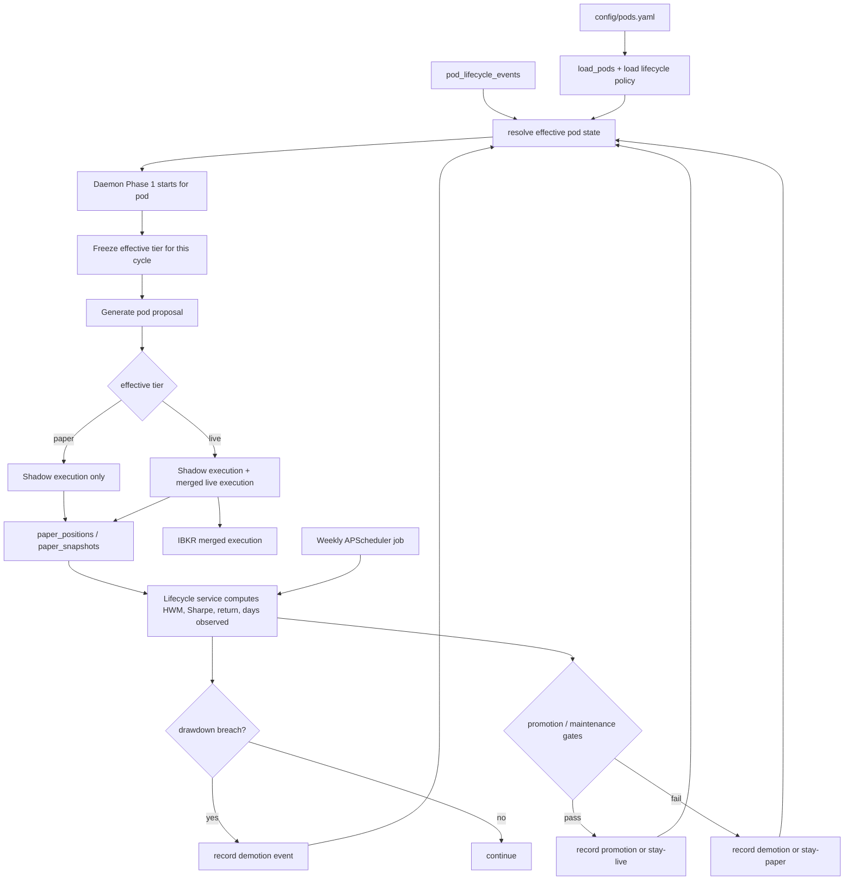

# feat: Governor Pod Lifecycle Automation

## Overview

Add automated pod promotion and demotion on top of the shipped pod, paper trading, and daemon systems. The daemon should evaluate pods weekly for promotion or maintenance, demote live pods immediately when they breach a hard drawdown stop, record every lifecycle transition in Decision DB, and expose manual overrides plus richer lifecycle status in `hedge pods`.

## Problem Frame

The system can now run pods autonomously, but pod tier assignment is still static YAML. That means the operator must inspect `hedge pods`, decide which pods deserve live capital, edit `config/pods.yaml`, and restart the daemon. That manual loop does not scale for 18 pods, and it blocks the stated trading pod shop goal of a promotion ladder from paper to live. (see origin: `docs/brainstorms/2026-03-25-governor-pod-lifecycle-requirements.md`)

The current architecture also has a planning-time gap: only paper-tier pods keep an isolated performance series in `paper_snapshots`, while live-tier pods are merged into one IBKR path. Without continuing a per-pod shadow equity curve after promotion, R3 and R4 in the origin doc are not implementable because live pods would have no pod-specific Sharpe or drawdown basis for demotion.

## Requirements Trace

- R1. Weekly Monday evaluation promotes eligible paper pods
- R2. Promotion gates use configurable minimum history, Sharpe, cumulative return, and max drawdown thresholds
- R3. Live pods are demoted immediately on hard drawdown breach during normal daemon execution
- R4. Weekly maintenance evaluation demotes live pods that no longer meet maintenance thresholds
- R5. All lifecycle transitions are recorded in Decision DB with reasons and metrics snapshot
- R6. CLI supports manual `hedge pods promote <pod>` and `hedge pods demote <pod>`
- R7. `hedge pods` shows current tier, days in tier, next evaluation date, and latest lifecycle event
- R8. Lifecycle thresholds are configurable from repo config with sensible defaults
- R9. Weekly evaluation and continuous drawdown checks run inside the daemon
- R10. Tier transitions take effect on the next run, not mid-run

## Scope Boundaries

- NOT capital allocation sizing or performance-weighted merge logic
- NOT a third tier, probation tier, or cooldown workflow
- NOT regime-dependent thresholds
- NOT correlation-aware promotion scoring
- NOT persistence of APScheduler jobs across process restart
- NOT a web UI dashboard for lifecycle state

## Context & Research

### Relevant Code and Patterns

- `src/config/pod_config.py` already loads pod-level runtime settings from `config/pods.yaml` and is the natural place to add lifecycle config parsing helpers.
- `src/services/daemon.py` owns recurring daemon jobs, retry semantics, and the per-pod Phase 1 / Phase 2 lifecycle. It is the correct home for weekly evaluation scheduling and next-run tier application.
- `src/services/portfolio_runner.py` already computes an effective tier per pod at execution time via `config.tier_override or pod.tier`; this is the seam to replace static YAML tier with runtime lifecycle state.
- `src/services/paper_engine.py` and `src/services/paper_metrics.py` already provide per-pod virtual portfolio state, mark-to-market, Sharpe, and max drawdown calculations.
- `src/data/decision_store.py` uses append-only tables plus passive-observer writes for audit data and a small mutable `daemon_runs` table for operational status. Lifecycle history belongs in a new append-only table, not in `daemon_runs`.
- `src/cli/hedge.py` currently exposes `hedge pods` as a top-level command and already reads Decision DB for pod proposals and paper performance.
- `tests/services/test_daemon.py`, `tests/services/test_paper_metrics.py`, `tests/data/test_decision_store.py`, and `tests/config/test_pod_config.py` already cover the nearest seams and should be extended rather than creating a separate testing style.

### Institutional Learnings

- `docs/solutions/architecture/monolith-decomposition-pod-abstraction.md`: pod-level data should stay explicit and append-only, and multi-source merges must use accumulation semantics rather than implicit overwrite.
- `docs/solutions/architecture/paper-trading-virtual-execution-engine.md`: paper portfolio state should remain the single per-pod performance source of truth, snapshot writes should stay centralized, and Decision DB remains a passive observer that must not break pipeline execution.
- No `docs/solutions/patterns/critical-patterns.md` file exists in this repo, so there is no separate critical-patterns overlay to apply.

### External References

- None used. The repo already has the required local patterns for config parsing, daemon scheduling, append-only audit storage, and per-pod performance computation.

## Key Technical Decisions

- **Persist lifecycle state in Decision DB, not YAML mutation**: `config/pods.yaml` remains the bootstrap/default configuration source. Automated promotions, demotions, and manual overrides are stored as lifecycle events in Decision DB and resolved into an effective runtime tier on each new pod cycle. This avoids rewriting config files from the daemon and removes any restart requirement.
- **Add a dedicated append-only `pod_lifecycle_events` table**: Lifecycle changes are audit data, so they should use the same append-only model as signals, proposals, and executions. `daemon_runs` remains operational metadata only.
- **Keep a shadow paper equity curve for live pods**: After promotion, a pod should continue to accumulate isolated paper snapshots and trade outcomes for lifecycle evaluation even while its proposal also participates in live merged execution. This intentionally supersedes the earlier paper-trading assumption that tier switch freezes the paper portfolio; without this change, live-pod demotion is not measurable.
- **Resolve effective tier at Phase 1 start and carry it through the cycle**: The daemon should compute the pod's effective tier once when Phase 1 starts, then use that same resolved tier for the linked Phase 2 execution. That satisfies R10 by preventing mid-cycle promotion or demotion from changing an in-flight run.
- **Store lifecycle thresholds in `config/pods.yaml` under a dedicated top-level `lifecycle` section**: Pod definitions stay focused on pod identity, while lifecycle policy stays centralized and reloadable from the same config file already used by the daemon.
- **Use a dedicated lifecycle service module**: Promotion eligibility, maintenance checks, HWM drawdown checks, effective-tier resolution, and status projection should live in a focused service rather than being spread across `daemon.py`, `paper_metrics.py`, and CLI formatting logic.

## Open Questions

### Resolved During Planning

- **Where should automated tier state live?** Decision DB lifecycle events, not YAML edits or daemon-only memory.
- **Where should lifecycle thresholds live?** A dedicated `lifecycle` section inside `config/pods.yaml`.
- **How can live pods be demoted based on pod-specific drawdown?** Continue maintaining each promoted pod's shadow paper book and metrics even while it also participates in live merged execution.
- **How should atomic next-run semantics work?** Resolve tier at Phase 1 start, pass that resolved tier into the linked Phase 2 cycle, and apply newer lifecycle events only to subsequent cycles.
- **Should lifecycle events reuse `daemon_runs`?** No. They require append-only audit semantics and richer metrics payloads than `daemon_runs` should carry.

### Deferred to Implementation

- Exact helper names and whether lifecycle config parsing belongs inside `pod_config.py` or a thin adjacent helper module
- Whether the effective tier for the in-flight cycle is best carried in `daemon_runs`, a cloned `Pod` object passed to APScheduler, or both for observability
- Whether `paper_metrics.py` should grow lifecycle-specific helpers or delegate immediately to a new lifecycle service

## High-Level Technical Design

> *This illustrates the intended approach and is directional guidance for review, not implementation specification. The implementing agent should treat it as context, not code to reproduce.*

## Implementation Units

- [x] **Unit 1: Lifecycle Config and Runtime State Resolution**

**Goal:** Define how lifecycle policy is loaded from config and how the system resolves a pod's effective tier from bootstrap config plus Decision DB events.

**Requirements:** R2, R6, R8, R10

**Dependencies:** None

**Files:**
- Modify: `src/config/pod_config.py`
- Modify: `config/pods.yaml`
- Create: `src/services/pod_lifecycle.py`
- Test: `tests/config/test_pod_config.py`
- Test: `tests/services/test_pod_lifecycle.py`

**Approach:**
- Add a top-level `lifecycle:` section to `config/pods.yaml` for defaults such as `min_history_days`, `promotion_sharpe`, `promotion_drawdown_pct`, `maintenance_sharpe`, `hard_stop_drawdown_pct`, and `evaluation_schedule`.
- Extend config loading with a small typed representation for lifecycle policy while keeping existing pod loading backward compatible.
- Add lifecycle-service helpers to resolve:
  - effective tier for a pod from latest lifecycle event or fallback YAML tier
  - whether the latest state is a manual override or automated evaluation outcome
  - next Monday evaluation date and current days-in-tier
- Keep the policy/global config separate from pod identity fields so future per-pod overrides remain possible without muddying `Pod`.

**Patterns to follow:**
- `src/config/pod_config.py` defaults-section parsing and validation style
- `src/services/paper_metrics.py` pure read/compute helper shape

**Test scenarios:**
- Missing `lifecycle` section falls back to sensible defaults
- Invalid threshold config raises a clear `ValueError`
- No lifecycle events means effective tier comes from YAML
- Latest promotion event overrides YAML paper tier for runtime state
- Latest manual demotion overrides prior promotion until a newer automated event arrives
- Days-in-tier and next evaluation date are computed deterministically

**Verification:**
- Config loading remains backward compatible for existing pods
- Effective-tier resolution can be called from daemon and CLI without mutating source config

- [x] **Unit 2: Decision DB Lifecycle Event Audit Trail**

**Goal:** Add append-only lifecycle event storage and query helpers for runtime resolution and status display.

**Requirements:** R5, R6, R7, R10

**Dependencies:** Unit 1

**Files:**
- Modify: `src/data/decision_store.py`
- Test: `tests/data/test_decision_store.py`

**Approach:**
- Add `pod_lifecycle_events` with fields sufficient to reconstruct current state and audit why it changed:
  - `id`
  - `pod_id`
  - `event_type` (`promotion`, `demotion`, `manual_promotion`, `manual_demotion`, `drawdown_stop`, `weekly_maintenance`)
  - `old_tier`, `new_tier`
  - `reason`
  - `source` (`manual`, `weekly_evaluation`, `drawdown_guard`)
  - metrics snapshot fields or a `metrics_json` payload containing `sharpe_ratio`, `cumulative_return_pct`, `max_drawdown_pct`, `observation_days`, `total_value`, `high_water_mark`
  - `daemon_run_id` and/or `run_id` linkage when present
  - `created_at`
- Add read helpers for latest event per pod, event history, and latest effective tier lookup.
- Keep writes wrapped in broad `try/except` like the rest of the Decision DB observer layer.

**Patterns to follow:**
- `record_paper_snapshot()` and `record_pod_proposal()` append-only insertion pattern
- `get_latest_daemon_run()` style latest-row projection

**Test scenarios:**
- Promotion and demotion events insert correctly
- Latest-event lookup returns the newest tier transition for a pod
- Manual override event supersedes earlier automated event in effective-tier resolution
- Event history remains append-only and ordered chronologically
- Missing or failed lifecycle writes do not raise into callers

**Verification:**
- Lifecycle event history is queryable without mutating existing tables
- Effective-tier lookups and CLI status can be served entirely from Decision DB plus config

- [x] **Unit 3: Lifecycle Metrics and Shadow Performance Continuity**

**Goal:** Build the per-pod lifecycle evaluator and ensure promoted live pods continue generating isolated performance data for demotion decisions.

**Requirements:** R1, R2, R3, R4, R9

**Dependencies:** Units 1-2

**Files:**
- Create: `src/services/pod_lifecycle.py`
- Modify: `src/services/paper_metrics.py`
- Modify: `src/services/paper_engine.py`
- Modify: `src/services/portfolio_runner.py`
- Test: `tests/services/test_pod_lifecycle.py`
- Test: `tests/services/test_paper_metrics.py`
- Test: `tests/services/test_paper_engine.py`

**Approach:**
- Add lifecycle-service methods that compute:
  - observation window sufficiency
  - cumulative return
  - current HWM drawdown
  - promotion eligibility
  - maintenance eligibility
  - immediate hard-stop breach
- Refactor metric computation so lifecycle evaluation can reuse one source of truth rather than duplicating logic in CLI formatting.
- Change the current tier split in `portfolio_runner.py` so promoted live pods still maintain their shadow paper book and snapshot stream while also contributing to live merged execution.
- Preserve existing paper-only semantics for pods that are still paper tier; the change is specifically that live pods no longer stop generating isolated lifecycle metrics.

**Technical design:** *(directional guidance, not implementation specification)*
- For each pod proposal:
  - synthesize/update the pod's shadow portfolio
  - write the shadow snapshot every cycle
  - if effective tier is `live`, also include the proposal in the merged live path
- Lifecycle evaluation reads the shadow series for both paper and live pods; it never tries to infer pod performance from the merged IBKR account.

**Patterns to follow:**
- `src/services/paper_engine.py` snapshot-building and append-only recording flow
- `src/services/portfolio_runner.py` existing per-pod execution loop and merged live proposal flow

**Test scenarios:**
- Promotion gate passes only when all thresholds are met
- Maintenance gate differs from promotion gate and can demote a live pod on weekly eval
- Hard-stop drawdown breach triggers demotion eligibility immediately
- Promoted live pod still accumulates shadow snapshots on later runs
- Mixed paper/live run continues to produce correct live merge behavior while shadow metrics remain pod-isolated

**Verification:**
- Lifecycle evaluation can be computed for a pod before and after promotion using one continuous per-pod metric history
- Live execution behavior remains merged, but per-pod demotion decisions no longer depend on impossible attribution from IBKR

- [x] **Unit 4: Daemon Scheduling and Atomic Tier Transitions**

**Goal:** Integrate weekly evaluation and continuous drawdown enforcement into the daemon without changing in-flight runs.

**Requirements:** R1, R3, R4, R9, R10

**Dependencies:** Units 1-3

**Files:**
- Modify: `src/services/daemon.py`
- Modify: `src/services/portfolio_runner.py`
- Test: `tests/services/test_daemon.py`
- Test: `tests/services/test_portfolio_runner.py`

**Approach:**
- Add a weekly APScheduler job for lifecycle evaluation, likely one global Monday job that iterates enabled pods rather than N separate jobs.
- At Phase 1 start, resolve the pod's effective runtime tier from lifecycle state and freeze that value for the linked cycle.
- Ensure Phase 2 uses the frozen tier from Phase 1, not a newly changed tier, so promotions/demotions affect the next cycle only.
- After shadow mark-to-market / execution for a live pod, run the hard-stop drawdown check and record a demotion event when breached.
- Weekly evaluation should record promotion/demotion/no-op outcomes without forcing daemon restart.

**Patterns to follow:**
- Existing `_schedule_phase1()`, `_schedule_phase2()`, and retry scheduling style in `src/services/daemon.py`
- Existing `analysis_only` / `execute_proposals()` split in `src/services/portfolio_runner.py`

**Test scenarios:**
- Weekly evaluation job is registered on daemon startup
- Eligible paper pod records promotion event
- Live pod with breached hard-stop records demotion event during normal cycle
- Demotion recorded during a cycle does not alter that cycle's already-frozen execution tier
- Next cycle resolves the new tier correctly without restart
- Drawdown guard failure to write an event does not crash the daemon

**Verification:**
- Daemon owns all automated lifecycle transitions
- Tier changes are visible on subsequent cycles only, preserving next-run atomicity

- [x] **Unit 5: CLI Overrides and Lifecycle-Aware Pod Status**

**Goal:** Expose manual lifecycle control and show enough state in `hedge pods` for an operator to trust the automation.

**Requirements:** R6, R7

**Dependencies:** Units 1-4

**Files:**
- Modify: `src/cli/hedge.py`
- Modify: `src/services/pod_lifecycle.py`
- Test: `tests/cli/test_hedge_pods.py`

**Approach:**
- Convert `hedge pods` from a single top-level command into a Click group while preserving `hedge pods` as the default status view.
- Add:
  - `hedge pods promote <pod_name>`
  - `hedge pods demote <pod_name>`
  - both commands record manual lifecycle events instead of editing YAML
- Extend status output with:
  - effective current tier
  - base configured tier
  - days in current tier
  - next evaluation date
  - latest lifecycle event / reason
- Keep existing proposal and paper-performance output, but source tier and lifecycle metadata from the lifecycle service rather than raw `Pod.tier` alone.

**Patterns to follow:**
- Existing Click command structure and error-handling style in `src/cli/hedge.py`
- Existing flat terminal table output used by `hedge pods`

**Test scenarios:**
- Manual promote command records a promotion override for a known pod
- Manual demote command records a demotion override
- Unknown pod name fails with clear guidance
- `hedge pods` shows effective tier from lifecycle state, not only YAML tier
- Latest event text and next evaluation date render for pods with and without lifecycle history

**Verification:**
- Operators can change pod tier without editing config or restarting the daemon
- Status output explains both what tier a pod is in and why

## System-Wide Impact

- **Interaction graph:** `config/pods.yaml` remains the bootstrap policy source, `pod_lifecycle_events` becomes the runtime state source, `daemon.py` becomes the automation trigger, `portfolio_runner.py` carries frozen effective tiers through a cycle, `paper_engine.py` continues isolated pod accounting, and `hedge.py` becomes the operator surface for overrides and inspection.
- **Error propagation:** Decision DB lifecycle writes should follow passive-observer semantics. A failed lifecycle write should degrade automation observability, not crash a rebalance or daemon cycle. The daemon should log evaluation failures and continue scheduling.
- **State lifecycle risks:** The main risk is contradictory tier sources. The plan avoids that by treating YAML as defaults and Decision DB lifecycle events as the current runtime override layer. Another risk is breaking prior assumptions that live pods stop generating paper snapshots; the shadow-book change must be implemented deliberately and regression-tested.
- **API surface parity:** `hedge rebalance`, daemon execution, and `hedge pods` all need to use the same effective-tier resolver so the CLI, scheduler, and status view cannot drift.
- **Integration coverage:** Unit tests alone will not prove this feature. At least one end-to-end scenario should cover paper pod promotion, subsequent live-cycle execution with continued shadow snapshots, and later demotion on drawdown.

## Risks & Dependencies

- The biggest implementation risk is the intentional change to the prior paper-trading rule that live promotion freezes paper history. The lifecycle feature requires shadow continuity, so the implementer must update that assumption consistently across code and docs.
- Lifecycle state that lives only in memory would break on daemon restart; the plan avoids that by persisting transitions in Decision DB.
- A naive manual override implementation could permanently pin pods or fight automated evaluation. Recording overrides as normal lifecycle events, with automated evaluations free to supersede them later, keeps the state model simple.
- This feature depends on the already shipped Pod Abstraction, Paper Trading, and Daemon Mode artifacts remaining stable.

## Documentation / Operational Notes

- Update session logs and project summary when the plan is created and when implementation lands, because the active roadmap item changes from “next up” to “planned”.
- After implementation, the paper-trading documentation and any references to “tier switch freezes paper portfolio” should be revised to reflect the new shadow-book rule.
- Operators should not expect manual `pods.yaml` tier edits to be the live source of truth once lifecycle automation is implemented; config expresses defaults, while Decision DB expresses current runtime state.

## Sources & References

- **Origin document:** [docs/brainstorms/2026-03-25-governor-pod-lifecycle-requirements.md](/Users/ksu541/Code/ai-hedge-fund/docs/brainstorms/2026-03-25-governor-pod-lifecycle-requirements.md)
- Related plan: [2026-03-25-001-feat-paper-trading-virtual-execution-plan.md](/Users/ksu541/Code/ai-hedge-fund/docs/plans/2026-03-25-001-feat-paper-trading-virtual-execution-plan.md)
- Related plan: [2026-03-25-002-feat-daemon-mode-always-on-scheduler-beta-plan.md](/Users/ksu541/Code/ai-hedge-fund/docs/plans/2026-03-25-002-feat-daemon-mode-always-on-scheduler-beta-plan.md)
- Related learning: [monolith-decomposition-pod-abstraction.md](/Users/ksu541/Code/ai-hedge-fund/docs/solutions/architecture/monolith-decomposition-pod-abstraction.md)
- Related learning: [paper-trading-virtual-execution-engine.md](/Users/ksu541/Code/ai-hedge-fund/docs/solutions/architecture/paper-trading-virtual-execution-engine.md)
- Related code: [pod_config.py](/Users/ksu541/Code/ai-hedge-fund/src/config/pod_config.py)
- Related code: [decision_store.py](/Users/ksu541/Code/ai-hedge-fund/src/data/decision_store.py)
- Related code: [daemon.py](/Users/ksu541/Code/ai-hedge-fund/src/services/daemon.py)
- Related code: [portfolio_runner.py](/Users/ksu541/Code/ai-hedge-fund/src/services/portfolio_runner.py)
- Related code: [paper_engine.py](/Users/ksu541/Code/ai-hedge-fund/src/services/paper_engine.py)
- Related code: [hedge.py](/Users/ksu541/Code/ai-hedge-fund/src/cli/hedge.py)
- Related PRs: #8, #9, #10
